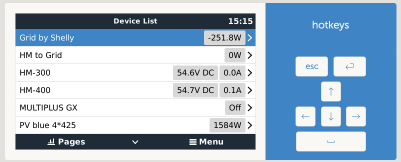

# dbus-opendtu

> **Attention:**
> ⚠️For any problems with OpenDTU prior v4.4.3 version, please update to the latest code where most Issues are fixed. OpenDTU changed the API. The same applies to AhoyDTU.⚠️

## Table of contents

* [Introduction](#introduction)
* [Installation](#installation)
  * [Get the code](#get-the-code)
  * [Service names](#service-names)
  * [Videos how to install](#videos-how-to-install)
* [Usage](#usage)
  * [Check if script is running](#check-if-script-is-running)
  * [How to debug](#how-to-debug)
  * [How to install](#how-to-install)
  * [How to restart](#how-to-restart)
  * [How to uninstall](#how-to-uninstall)
* [How does it work](#how-does-it-work)
  * [Pictures](#pictures)
* [Tested Devices](#tested-devices)
* [Troubleshooting](#troubleshooting)
  * [Security settings in OpenDTU](#security-settings-in-opendtu)
* [Inspiration](#inspiration)
* [Furher reading](#further-reading)
  * [used documentation](#used-documentation)
  * [Discussions on the web](#discussions-on-the-web)

---

## Introduction

This project integrates (supported) Hoymiles Inverter into Victron Energy's (Venus OS) ecosystem as dcload. Only OpenDTU is supported. The support for AHOY and templates hav been removed from the original project. After that the script have been extended with the script file https://github.com/vincegod/dbus-shelly-em-smartmeter/blob/main/dbus-shelly-em-smartmeter.py for Shelly EM integration. 

The intention of this project is to integrate the Hoymiles micro inverter connected to the battery into the GX system and control them by the grid meter. As grid meter a shelly EM is used. 

The next step is to implemet the control loop! 



---

## Installation

With the scripts in this repo, it should be easy possible to install, uninstall, restart a service that connects the OpenDTU or Ahoy to the VenusOS and GX devices from Victron.

### Get the code

Just grap a copy of the main branch and copy the content to `/data/` e.g. `/data/dbus-opendtu`.
After that call the `install.sh script.

The following commands should do everything for you:

```bash
wget https://github.com/hkaest/dbus-opendtu-DC-load/archive/refs/heads/main.zip
unzip main.zip "dbus-opendtu-DC-load-main/*" -d /data
mv /data/dbus-opendtu-DC-load-main /data/dbus-opendtu
chmod a+x /data/dbus-opendtu/install.sh
```

⚠️**Edit the following configuration file according to your needs before proceeding**⚠️ see [Configuration](#configuration) for details.

```bash
nano /data/dbus-opendtu/config.ini
```

Tha last step is to install the service and remove the downloaded files:

```bash
/data/dbus-opendtu/install.sh
rm main.zip
```

Check configuration after that - because the service is already installed and running. In case of wrong connection data (host, username, pwd) you will spam the log-file! Also, check to **set a** proper (minimal) **log level**

---

## Usage

This are some useful commands which helps to use the script or to debug.

### Check if script is running

`svstat /service/dbus-opendtu` show if the service (our script) is running. If number of seconds show is low, the it is probably restarting and you should look into `/data/dbus-opendtu/current.log`.

### How to debug

`dbus-spy` show all DBus values interactively.

This is useful to check if the script is running and sending values to Venus OS.

### How to install

`/data/dbus-opendtu/install.sh` installs the service persistently (see above).

This also activates the service, so you don't need to run `svcadm enable /service/dbus-opendtu` manually.

### How to restart

`/data/dbus-opendtu/restart.sh` restarts the service - e.g. after a config.ini change.

This also clears the logfile, so you can see the latest output in `/data/dbus-opendtu/current.log`.

### How to uninstall

`/data/dbus-opendtu/uninstall.sh` stops the service and prevents it from being restarted (e.g. after a reboot).

If you want to remove the service completely, you can do so by running `rm -rf /data/dbus-opendtu`.

---

## How does it work

The script is inspired by @fabian-lauer dbus-shelly-3em-smartmeter implementation. So what is the script doing:

* Running as a service
* Connecting to DBus of the Venus OS `com.victronenergy.pvinverter.http_{DeviceInstanceID_from_config}`
* After successful DBus connection, OpenDTU (resp. Ahoy) is accessed via REST-API - simply the `/status` (resp. `api/live`) is called which returns a JSON with all details.
  * A sample JSON file from OpenDTU can be found [here](docs/OpenDTU.json).
  * A sample JSON file from Ahoy can be found [here](docs/ahoy_0.6.9_live.json)
* Serial/devicename is taken from the response as device serial
* Paths are added to the DBus with default value 0 - including some settings like name etc.
* After that, a "loop" is started which pulls OpenDTU/AhoyDTU data every 5s (configurable) from the REST-API and updates the values in the DBus, for ESP 8266 based ahoy systems we even pull data only every 10seconds.

Thats it 😄

---

## Tested Devices

The code allows you to query either an Ahoy or OpenDTU Device, plus multiple template based (PV) Inverter in a single script.

Following combinations are possible:

* Use one or more devices configured via template configuration
* Use a OpenDTU device
* Use a AhoyDTU device
* Use either a OpenDTU or a AhoyDTU device and one or more template devices.

Tested examples for template devices:

* Tasmota unauthenticated
* Shelly 1 PM authenticated/unauthenticated
* Shelly Plus 1 PM unathenticated

All [configuration](#configuration) is done via config.ini. Examples are commented in config.ini

---

## Troubleshooting

Please open a new issue on github, only here we can work on your problem in a structured way: <https://github.com/henne49/dbus-opendtu/issues/new/choose>

⚠️ **Change the Logging Parameter under DEFAULT in /data/dbus-opendtu/config.ini to Logging = DEBUG, please revert, once debugging and troubleshooting is complete. Rerun the script and share the current.log file**.

Please provide the config.ini and JSON file and upload to the github issues, you can download the JSON file using your browser or using a commandline like tool like curl

| Type of DTU | URL |
| ------------- | ------------- |
| OpenDTU | <http://REPLACE_WITH_YOUR_IP_OR_HOSTNAME/api/livedata/status> |
| Ahoy | <http://REPLACE_WITH_YOUR_IP_OR_HOSTNAME/api/live> |
| Template Tasmota| <http://REPLACE_WITH_YOUR_IP_OR_HOSTNAME/cm?cmnd=STATUS+8> |
| Template Shelly 1 | <http://REPLACE_WITH_YOUR_IP_OR_HOSTNAME/status> |
| Template Shelly Plus | <http://REPLACE_WITH_YOUR_IP_OR_HOSTNAME/rpc/Switch.GetStatus?id=0> |
| Template Your Own | You will know best|

OpenDTU Curl example which uses jq to make the output pretty:

```bash
curl http://REPLACE_WITH_YOUR_IP_OR_HOSTNAME/api/livedata/status | jq > export.json
```

also describe the problem as best as you can.

Please also show, what you can see in Venus OS and VRM Portal, as the source of truth is Venus OS and not VRM.

### Security settings in OpenDTU

For openDTU, you can use authentication for the web Interface, but allow access to the status page unauthenticated. For this please use the settings like below.


---

## Inspiration

Idea is inspired on @fabian-lauer & @vikt0rm project linked below.
This project is my first on GitHub and with the Victron Venus OS, so I took some ideas and approaches from the following projects - many thanks for sharing the knowledge:

* [dbus-shelly-3em-smartmeter](https://github.com/fabian-lauer/dbus-shelly-3em-smartmeter)
* [shelly-api-docs](https://shelly-api-docs.shelly.cloud/gen1/#shelly1-shelly1pm)
* [Victron Wiki](https://github.com/victronenergy/venus/wiki/dbus#pv-inverters)
* [dbus-shelly-1pm-pvinverter](https://github.com/vikt0rm/dbus-shelly-1pm-pvinverter)
* [OpenDTU](https://github.com/tbnobody/OpenDTU )
* [OpenDTU Web-API Docs](https://github.com/tbnobody/OpenDTU/blob/master/docs/Web-API.md)
* [AhoyDTU](https://ahoydtu.de/)
* [AhoyDTU git](https://github.com/lumapu/ahoy)

---

## Further reading

If you like to read more about the Venus OS and the DBus, please check the following links and sites.

### used Documentation

* [DBus paths for Victron namespace](https://github.com/victronenergy/venus/wiki/dbus#pv-inverters)
* [DBus API from Victron](https://github.com/victronenergy/venus/wiki/dbus-api)
* [How to get root access on GX device/Venus OS](https://www.victronenergy.com/live/ccgx:root_access)
* [OpenDTU Web-API](https://github.com/tbnobody/OpenDTU/blob/master/docs/Web-API.md)

### Discussions on the web

This module/repository has been posted on the following threads:

* [Community Victronenergy](https://community.victronenergy.com/questions/169076/opendtu-as-pv-inverter-in-venusos.html)
