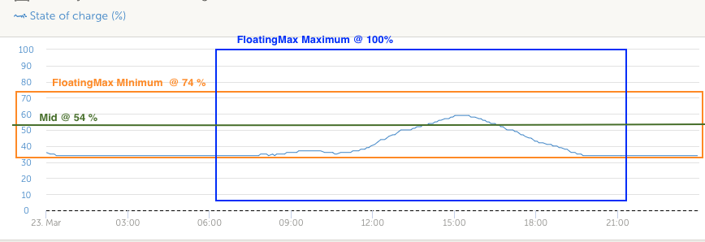

# dbus-opendtu-DC-load

## Table of contents

* [Introduction](#introduction)
* [Installation](#installation)
* [How does it work](#how-does-it-work)
* [Usage](#usage)
* [Tested Devices](#tested-devices)
* [Inspiration](#inspiration)
* [Furher reading](#further-reading)

---

## Introduction

This project integrates (supported) Hoymiles Inverter into Victron Energy's (Venus OS) ecosystem. 

Activating the option "Has DC System", dcload has no effect on the charge current limit (CCL aka /Link/ChargeCurrent @ mppt). The limit stick to the CCL of the battery even if the load is consuming power. Therefore the DBUS namespace dcsystem has been added to sum up the power of the HMs.   

The small foot note [here](https://www.victronenergy.com/media/pg/Cerbo_GX/en/dvcc---distributed-voltage-and-current-control.html) was the key and the fact, that only dcsystem is used in [dbus_systemcalc.py](https://github.com/victronenergy/dbus-systemcalc-py/blob/master/dbus_systemcalc.py#L189) and [dvcc.py](https://github.com/victronenergy/dbus-systemcalc-py/blob/aa24168627f5f9c04ef5b2d7a1d716a0ecac502c/delegates/dvcc.py#L1051) to provide the path com.victronenergy.system/Dc/System/Power:
> If you have one or more shunts configured for "DC system" (when more than one, they are added together), then the DVCC charge current limit compensates for both loads and chargers. It will add extra charge current if there is a load, and subtract it if there is another charger in the DC system. DC "loads" and "sources" are not compensated for in either direction.

> [!NOTE]
> A seperate DC system has been introduced to increase the CCL of the battery. With this DC system the HM inverters can be switched back to DC load, since only the DC load data can be visualized in VRM. The consumed power of the DC loads are added to the seperate DC system to be used for com.victronenergy.system/Dc/System/Power.

This project has been forked from https://github.com/henne49/dbus-opendtu. But there are many differences: 
* Only OpenDTU (logic is state of the art) is supported.
* The support for AHOY and templates have been removed from the original project.
* The script have been extended with the script file https://github.com/vincegod/dbus-shelly-em-smartmeter/blob/main/dbus-shelly-em-smartmeter.py for Shelly EM integration.
* None of the original services are used. This project uses com.victronenergy.dcload instead.
* A dcsystem has been added to sum up the dcloads to set the MPPT current limit higher than the charge current limit (CCL) of the battery.
* DbusMonitor is used to get data (CCL etc.) from the battery.

The remaining logic is available open source from Victron and others. To make the differences more visible, the fork has been detachted (requested via GitHub virtual assistant).

> [!WARNING]
> This project is used in an private environment. It is based on open source code (licenses). Nevertheless, using this code or parts of it in an commercial application may still violate some non-open-source licenses.

The intention of this project is to integrate the Hoymiles micro inverter connected to the battery into the GX system and control them by the grid meter. As grid meter a shelly EM is used. 

A HM as DC System to see the temperature and to be part of "Has DC system". The DTU set value for the AC side watt as AUX voltage.  

This picture shows the representation of a com.victronenergy.dcload in the remote console. 

The solution tracks all HM inverters in one class, since the all inverters are accessed via one DTU. This way only a single http request is required to get the data for all HMs from the DTU.

A other solution would be to create a singleton DBUS service for one inverter and instantiate multiple DBUS services by copying the python stuff:

```bash
cp /data/dbus-opendtu /data/dbus-opendtu_2
nano /data/dbus-opendtu_2/config.ini
/data/dbus-opendtu_2/install.sh
```
<br>
> [!NOTE]
> This project is used in a specific context (see below). Therefore, there are some parts in the code that have been implemented for this specific context. The code does not fit into other contexts, but can be used as a blueprint for other contexts.  
<br>

---

## Installation

With the scripts in this repo, it should be easy possible to install, uninstall, restart a service that connects the OpenDTU to the VenusOS and GX devices from Victron.

### Get the code

The following commands should do everything for you:

Log in via console, e.g. `ssh root@192.168.178.149`

Clean up before load and load and open the ini file

```bash
/data/dbus-opendtu/uninstall.sh
rm -rf /data/dbus-opendtu
rm -rf /data/dbus-opendtu-DC-load-main
wget https://github.com/hkaest/dbus-opendtu-DC-load/archive/refs/heads/main.zip
unzip main.zip "dbus-opendtu-DC-load-main/*" -d /data
mv /data/dbus-opendtu-DC-load-main /data/dbus-opendtu
chmod a+x /data/dbus-opendtu/install.sh
nano /data/dbus-opendtu/config.ini
```

> [!IMPORTANT]
> Edit the following configuration file according to your needs before proceeding, see [Configuration](#configuration) for details.

After editing the ini file, install the service and remove the downloaded files and check disk usage:

```bash
/data/dbus-opendtu/install.sh
rm main.zip
svstat /service/dbus-opendtu
nano /data/dbus-opendtu/current.log
```

Check configuration after that - because the service is already installed and running. In case of wrong connection data (host, username, pwd) you will spam the log-file! Also, check to **set a** proper (minimal) **log level**

### Usage of the alarm /Alarms/... to raise an (communication) error at DC system (HMs) 

The alarm is set with an communication error during a http post or get request and reset with each succesfully post or get request. (Naming may differ with Aux = Generator)

````
    _alarm_mapping = {
        ALARM_GRID:"/Alarms/LowVoltage",
        ALARM_TEMPERATURE:"/Alarms/HighVoltage",
        ALARM_DTU:"/Alarms/LowAuxVoltage",
        ALARM_HM:"/Alarms/HighAuxVoltage",
        ALARM_BALCONY:"/Alarms/LowTemperature",
        ALARM_BATTERY:"/Alarms/HighTemperature",}
````

> [!TIP]
> Remember the alarm should be reset in the remote console in the "Notifications" menu. 
---

## How does it work

### SOC is read to to calculate a seasonal SOC min value to deactivate HM feeding to grid via stopping life signal

The SOC of the battery is read and a floating max value has been added to realize an automatic increase of the generel min SOC in winter when the SOC hub is small and decrease in sommer when SOC hub (max) is bigger.

Get the value for e.g. Max:

```bash
dbus -y com.victronenergy.acload.http_59 /SocFloatingMax GetValue
```

And setting the value is also possible, the % makes dbus evaluate what comes behind it, resulting in an int instead of the default (a string). The range is 10..99%:

```bash
dbus -y com.victronenergy.acload.http_59 /SocFloatingMax SetValue %73
```



|highest SOC value of the curve|Result|
|--|--|
|higer than current /SocFloatingMax|set /SocFloatingMax to the value|
|lower than current /SocFloatingMax|decrement /SocFloatingMax by 1|
|100%|set /SocFloatingMax to 100% or more to have 100% for a longer time

/SocFloatingMax is increased faster than decreased. Since having a maximum of SOC range available is more important. In autumn the SOC is getting smaller slowly to hit the mimimum range for winter time.

### Max feed in of the HM inverters can be set

In this example, the 0 indicates succes. When trying an unsupported value the result is not 0. For legal reasons the value is limited to 800 (Watts).

Set and get max. feed in value in watts:
```bash
dbus -y com.victronenergy.acload.http_59 /MaxFeedIn GetValue
```

And setting the value is also possible, the % makes dbus evaluate what comes behind it, resulting in an int instead of the default (a string):
```bash
dbus -y com.victronenergy.acload.http_59 /MaxFeedIn SetValue %700
```
### When the max SOC is reached, the inverters can feed in more than zero feed in would allow 

Set and get min SOC to feed in max to grid in % (max 99%). In case no consume with inverter is planned:
```bash
dbus -y com.victronenergy.acload.http_59 /PowerFeedInSoc GetValue
```

And setting the value is also possible, the % makes dbus evaluate what comes behind it, resulting in an int instead of the default (a string):
```bash
dbus -y com.victronenergy.acload.http_59 /PowerFeedInSoc SetValue %60
```
### Power consumption meassurement

The power consumption is meassured with a Shelly EM as grid meter. Since the power consumption is volatile the measurement tries to calculate a internal value for the power consumption that follows increasing consumption a little bit delayed, but follows a decreasing power consumption immediately. This way feed in to grid is avoided and short peaks in consumption are partly ignored. 

|grid meter value|reaction|
|--|--|
|negative (more than ACCURACY=10)|adapt new value immendiately (as long feedInFilterFactor=0)|
|value change difference is high (feedInAtNegativeWattDifference)|a peak is gone, adapt new value immediately (as long feedInFilterFactor=0)|
|otherwise|calculate a average based on old value with <br>SMA(x) = (SMA(t - 1) * factor + x) / (factor + 1)|

### Calculate HM's feed in

Based on the internal value for the power consumption the feed in value is calculated and passed to the HMs. The HMs are controlled via a list and a loop over this list. To use all HM in the loop equally, the list order is changed regulary. To prevent over-heating the HM's temperature is contolled. 

First the max feed in value is calculated. As for legal reason it is limited to 800 Watts. Since a legacy plug in solar is connected to grid the curremt feed in power of this must be subtracted from the max feed in value. In the next step, the value must not exceed the current DCL of the battery. At the end the required feed in (change) of the HMs is set and passed to the HMs together with the max allowed feed in value.  

|SOC condition|set value for grid|
|--|--|
|/SocFloatingMax > 100%|battery has been fully charged last time, feed in ZeroPoint=25 (Watts)|
|current SOC > /PowerFeedInSoc|feed in a little bit more (multiple of ZeroPoint)|
|otherwise|reduce power consumption to the value of ZeroPoint|

---

## Usage

This are some useful commands which helps to use the script or to debug.

### Check if script is running

```bash
svstat /service/dbus-opendtu
```
This shows if the service (our script) is running. If number of seconds show is low, the it is probably restarting and you should look into:
```bash
nano /data/dbus-opendtu/current.log
```

### How to debug

```bash
dbus-spy
```
This shows all DBus values interactively. This is useful to check if the script is running and sending values to Venus OS.

### How to install

```bash
/data/dbus-opendtu/install.sh
```
This installs the service persistently (see above).

This also activates the service, so you don't need to run manually:
```bash
svcadm enable /service/dbus-opendtu
```

### How to restart

```bash
/data/dbus-opendtu/restart.sh
```
This restarts the service - e.g. after a config.ini change.

This also clears the logfile, so you can see the latest output in: 
```bash
nano /data/dbus-opendtu/current.log 
```

### How to uninstall

```bash
/data/dbus-opendtu/uninstall.sh
```
This stops the service and prevents it from being restarted (e.g. after a reboot).

If you want to remove the service completely, you can do so by running:
```bash
rm -rf /data/dbus-opendtu
```

---

## Tested Devices

HM-300 and HM-400 connected to battery and Shelly EM as single phase grid meter together with a Multiplus II GX. For the HMs a OpenDTU ESP32 gateway is used.


---

## Inspiration

As a starting point the solution from henne49 has been used (disconnected fork) which is based on @fabian-lauer & @vikt0rm project. Other ideas are from Selbstbau-PV and pulquero.

This project is my first on GitHub and with the Victron Venus OS, so I took some ideas and approaches from the following projects - many thanks for sharing the knowledge:

* [dbus-shelly-3em-smartmeter](https://github.com/fabian-lauer/dbus-shelly-3em-smartmeter)
* [Zero Grid (Nulleinspeisung Hoymiles HM-1500 mit OpenDTU & Python Steuerung)](https://github.com/Selbstbau-PV/Selbstbau-PV-Hoymiles-nulleinspeisung-mit-OpenDTU-und-Shelly3EM)
* [OpenDTU](https://github.com/tbnobody/OpenDTU )
* [henne49/dbus-opendtu](https://github.com/henne49/dbus-opendtu)
* [As a "eaay-to-use" blueprint for DBusMonitor w/o callbacks](https://github.com/pulquero/DCSystemAggregator)

---

## Further reading

If you like to read more about the Venus OS and the DBus, please check the following links and sites.

### used Documentation

* [DBus paths for Victron namespace](https://github.com/victronenergy/venus/wiki/dbus#pv-inverters)
* [DBus API from Victron](https://github.com/victronenergy/venus/wiki/dbus-api)
* [How to get root access on GX device/Venus OS](https://www.victronenergy.com/live/ccgx:root_access)
* [General python library within Victron, related to D-Bus and the GX, dbusmonitor and dbusdummyservice as an DBUS template](https://github.com/victronenergy/velib_python/tree/master)
* [OpenDTU Web-API](https://github.com/tbnobody/OpenDTU/blob/master/docs/Web-API.md)
* [shelly-api-docs](https://shelly-api-docs.shelly.cloud/gen1/#shelly1-shelly1pm)
* [OpenDTU Web-API Docs](https://github.com/tbnobody/OpenDTU/blob/master/docs/Web-API.md)


