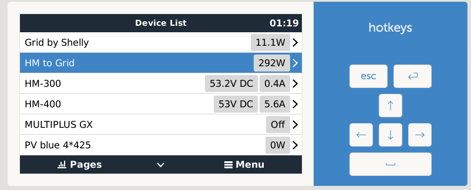
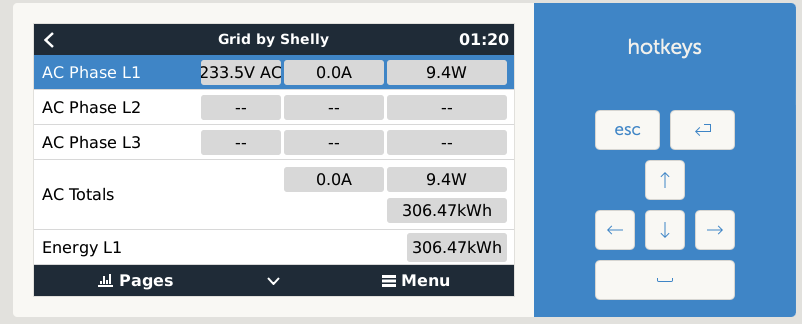
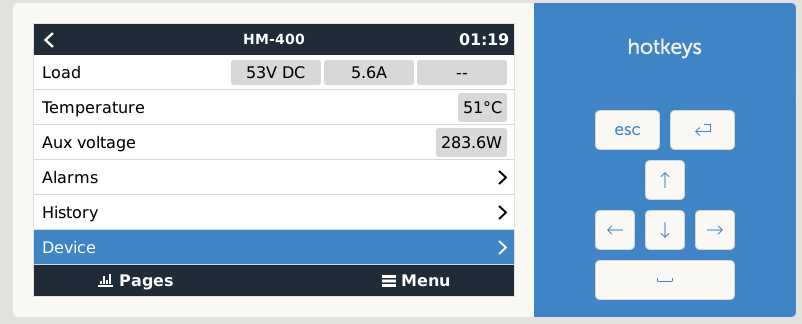
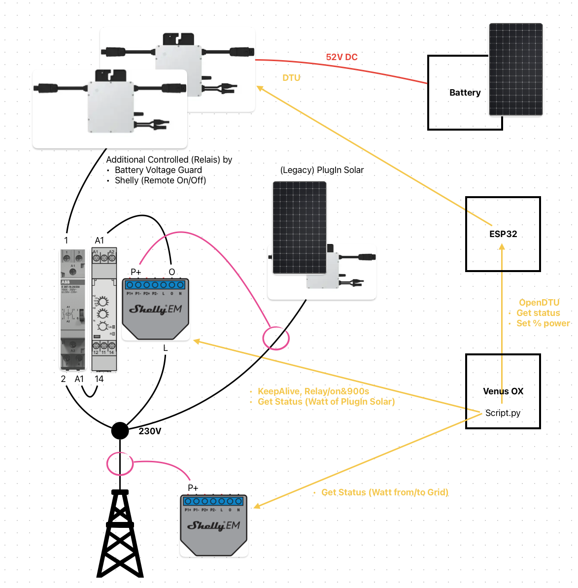

# dbus-opendtu-DC-load

## Table of contents

* [Introduction](#introduction)
* [Installation](#installation)
  * [Get the code](#get-the-code)
  * [Service names](#service-names)
  * [Videos how to install](#videos-how-to-install)
* [Usage](#usage)
  * [Check if script is running](#check-if-script-is-running)
  * [How to debug](#how-to-debug)
  * [How to install](#how-to-install)
  * [How to restart](#how-to-restart)
  * [How to uninstall](#how-to-uninstall)
* [How does it work](#how-does-it-work)
  * [Pictures](#pictures)
* [Tested Devices](#tested-devices)
* [Inspiration](#inspiration)
* [Furher reading](#further-reading)
  * [used documentation](#used-documentation)
  * [Discussions on the web](#discussions-on-the-web)

---

## Introduction

This project integrates (supported) Hoymiles Inverter into Victron Energy's (Venus OS) ecosystem as dcload. 

This project has been forked from https://github.com/henne49/dbus-opendtu. But there are many differences: 
* Only OpenDTU (logic is state of the art) is supported.
* The support for AHOY and templates have been removed from the original project.
* The script have been extended with the script file https://github.com/vincegod/dbus-shelly-em-smartmeter/blob/main/dbus-shelly-em-smartmeter.py for Shelly EM integration.
* None of the original services are used. This project uses com.victronenergy.dcload instead.
The remaining logic is available open source from Victron and others. Therefore the license from https://github.com/henne49/dbus-opendtu is not correct. Therefore, and to make the differences more visible, the fork has been detachted (requested via GitHub virtual assistant).

Nevertheless, this project is used in an private environment. Using this code in an commercial application may still violate some licenses.

The intention of this project is to integrate the Hoymiles micro inverter connected to the battery into the GX system and control them by the grid meter. As grid meter a shelly EM is used. 

One Shelly and two HM micro inverter in the list: 


The Shelly as AC load. As grid would break the VRM logic in my configuration. 


A HM as DC load to see the temperature. The DTU set value for the AC side watt as AUX voltage.  


---

## Installation

With the scripts in this repo, it should be easy possible to install, uninstall, restart a service that connects the OpenDTU or Ahoy to the VenusOS and GX devices from Victron.

### Get the code

Just grap a copy of the main branch and copy the content to `/data/` e.g. `/data/dbus-opendtu`.
After that call the `install.sh script.

The following commands should do everything for you:

Log in via console, e.g. `ssh root@192.168.178.149`

```bash
wget https://github.com/hkaest/dbus-opendtu-DC-load/archive/refs/heads/main.zip
unzip main.zip "dbus-opendtu-DC-load-main/*" -d /data
mv /data/dbus-opendtu-DC-load-main /data/dbus-opendtu
chmod a+x /data/dbus-opendtu/install.sh
```

⚠️**Edit the following configuration file according to your needs before proceeding**⚠️ see [Configuration](#configuration) for details.

```bash
nano /data/dbus-opendtu/config.ini
```

Tha last step is to install the service and remove the downloaded files:

```bash
/data/dbus-opendtu/install.sh
rm main.zip
```

Check configuration after that - because the service is already installed and running. In case of wrong connection data (host, username, pwd) you will spam the log-file! Also, check to **set a** proper (minimal) **log level**

---

## Usage

This are some useful commands which helps to use the script or to debug.

### Check if script is running

`svstat /service/dbus-opendtu` show if the service (our script) is running. If number of seconds show is low, the it is probably restarting and you should look into `/data/dbus-opendtu/current.log`.

### How to debug

`dbus-spy` show all DBus values interactively.

This is useful to check if the script is running and sending values to Venus OS.

### How to install

`/data/dbus-opendtu/install.sh` installs the service persistently (see above).

This also activates the service, so you don't need to run `svcadm enable /service/dbus-opendtu` manually.

### How to restart

`/data/dbus-opendtu/restart.sh` restarts the service - e.g. after a config.ini change.

This also clears the logfile, so you can see the latest output in `nano /data/dbus-opendtu/current.log`. 

### How to uninstall

`/data/dbus-opendtu/uninstall.sh` stops the service and prevents it from being restarted (e.g. after a reboot).

If you want to remove the service completely, you can do so by running `rm -rf /data/dbus-opendtu`.


---

## How does it work

The script is inspired by @fabian-lauer dbus-shelly-3em-smartmeter implementation. So what is the script doing:

* Running as a service
* Connecting to DBus of the Venus OS `com.victronenergy.pvinverter.http_{DeviceInstanceID_from_config}`
* After successful DBus connection, OpenDTU (resp. Ahoy) is accessed via REST-API - simply the `/status` (resp. `api/live`) is called which returns a JSON with all details.
  * A sample JSON file from OpenDTU can be found [here](docs/OpenDTU.json).
  * A sample JSON file from Ahoy can be found [here](docs/ahoy_0.6.9_live.json)
* Serial/devicename is taken from the response as device serial
* Paths are added to the DBus with default value 0 - including some settings like name etc.
* After that, a "loop" is started which pulls OpenDTU/AhoyDTU data every 5s (configurable) from the REST-API and updates the values in the DBus, for ESP 8266 based ahoy systems we even pull data only every 10seconds.

Thats it 😄

---

## Tested Devices

HM-300 and HM-400 connected to battery and Shelly EM as single phase grid meter together with a Multiplus II GX. For the HMs a OpenDTU ESP32 gateway is used.


---

## Inspiration

Idea is inspired on @fabian-lauer & @vikt0rm project linked below.
This project is my first on GitHub and with the Victron Venus OS, so I took some ideas and approaches from the following projects - many thanks for sharing the knowledge:

* [dbus-shelly-3em-smartmeter](https://github.com/fabian-lauer/dbus-shelly-3em-smartmeter)
* [Zero Grid (Nulleinspeisung Hoymiles HM-1500 mit OpenDTU & Python Steuerung)](https://github.com/Selbstbau-PV/Selbstbau-PV-Hoymiles-nulleinspeisung-mit-OpenDTU-und-Shelly3EM)
* [OpenDTU](https://github.com/tbnobody/OpenDTU )

---

## Further reading

If you like to read more about the Venus OS and the DBus, please check the following links and sites.

### used Documentation

* [DBus paths for Victron namespace](https://github.com/victronenergy/venus/wiki/dbus#pv-inverters)
* [DBus API from Victron](https://github.com/victronenergy/venus/wiki/dbus-api)
* [How to get root access on GX device/Venus OS](https://www.victronenergy.com/live/ccgx:root_access)
* [OpenDTU Web-API](https://github.com/tbnobody/OpenDTU/blob/master/docs/Web-API.md)
* [shelly-api-docs](https://shelly-api-docs.shelly.cloud/gen1/#shelly1-shelly1pm)
* [OpenDTU Web-API Docs](https://github.com/tbnobody/OpenDTU/blob/master/docs/Web-API.md)

### Discussions on the web

t.b.d. for example see https://github.com/henne49/dbus-opendtu
